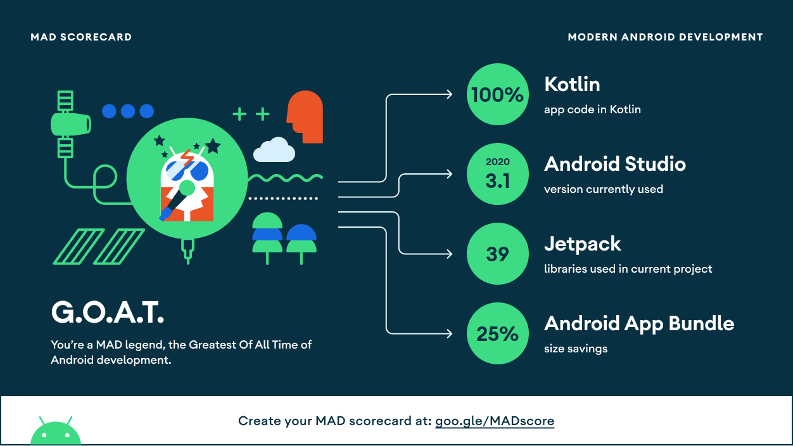
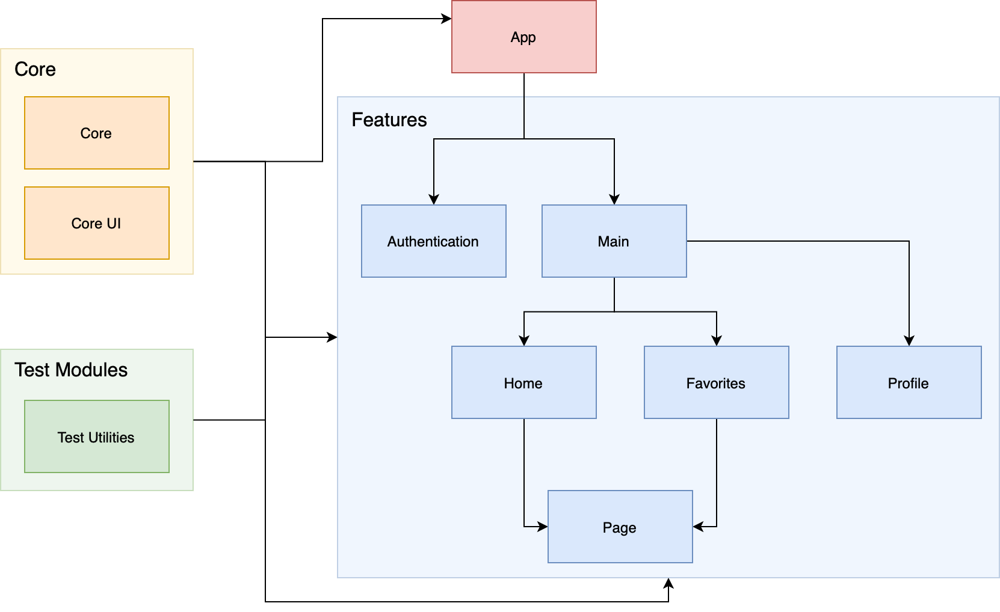

<h1 align="center">Alin Chinese</h1>

  
  
   
   

  
Alin Chinese is a good start for people who learn Chinese or are curious about the Chinese language. It has summarized, for you, all the key points of Chinese grammar (patterns/words/expressions) that beginners need to master in the first stage, which is concise and easy to understand.

## Tech stack & Open-source libraries

### Language

- [Kotlin](https://kotlinlang.org)
- [Coroutines](https://kotlinlang.org/docs/coroutines-overview.html) & [Flow](https://kotlinlang.org/docs/flow.html) for asynchronous programming

### Android Software Development Kit 

- Target level 30
- Minimum level 23

### Open-source Libraries

- [Coil](https://github.com/coil-kt/coil) - an image loading library backed by Kotlin Coroutines
- [Gson](https://github.com/google/gson) - a JSON library for Kotlin and Java.
- [UniFlow](https://github.com/uniflow-kt/uniflow-kt) - simple Unidirectional Data Flow for Android & Kotlin
- [Dagger Hilt](https://dagger.dev/hilt/) - a dependency injection library for Android
- [ViewBindingDelegate](https://github.com/kirich1409/ViewBindingPropertyDelegate) - a property delegate for [ViewBinding](https://developer.android.com/topic/libraries/view-binding)

### Jetpack Libraries

- [Room Persistence](https://developer.android.com/jetpack/androidx/releases/room) - an abstraction layer over SQLite
- [Paging 3](https://developer.android.com/topic/libraries/architecture/paging/v3-overview) - a library to load and display pages of data from a larger dataset
- [Navigation](https://developer.android.com/jetpack/androidx/releases/navigation) - a framework for navigating between 'destinations' 
- [Lifecycle](https://developer.android.com/jetpack/androidx/releases/lifecycle) - live data Kotlin extensions

### Test Libraries
- [JUnit](https://junit.org/junit4/) - a simple framework to write repeatable tests
- [Espresso](https://developer.android.com/training/testing/espresso) - Android UI tests
- [MockK](https://mockk.io) - a mocking library for Kotlin

### Backend
- [Firestore](https://firebase.google.com/docs/firestore) - a cloud-hosted, NoSQL database
- [Firebase Authnetication](https://firebase.google.com/docs/auth) - backend services to authenticate users

## MAD Score

## Architecture

AlinChinese is based on Multi-Module Clean Architecture using Unidirectional Data Flow(MVI) in the presentation layer.

## Download

## Roadmap

See the [open issues](https://github.com/merklol/Alin-Chinese/issues) for a list of proposed features (and known issues).

## Suggestions

If you have general suggestions, please feel free to submit a new [Github issue](https://github.com/merklol/Alin-Chinese/issues/new).

## License

Distributed under the MIT License. See [LICENSE](LICENSE.md) for more information.

## Contact

Maxim Smolyakov - [LinkedIn](https://linkedin.com/in/maxim-smolyakov-8945211a5) - [Email](mailto:sm.makism@icloud.com) - [Facebook](https://www.facebook.com/merk.merklol)
